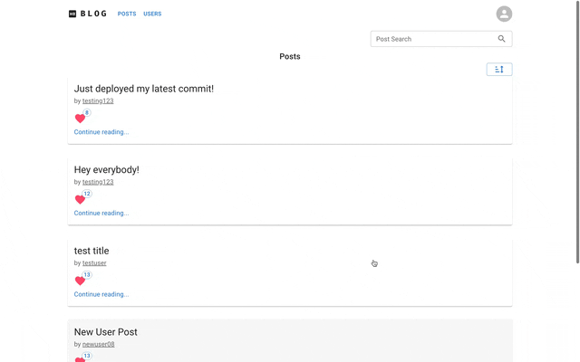

# Blog

Blog app inspired by exercises up to Part 8 of <https://fullstackopen.com/en/>.

**Link to project:** <https://fullstack-blog-v721.onrender.com/>

## How It's Made

**Tech used:** React, Express / Node.js, Mongoose / MongoDB, Redux Toolkit, RTK Query, React Router, Material UI, and Vite

## Optimizations

This is a simple app for creating blog posts. Everyone can view all posts, but users must create an account in order to add new posts and to like others' posts. Users have the option of deleting their own posts.

Future versions will add the ability to comment on others' posts, the ability to update posts, an improved UI for creating posts, and an improved search function. I'll also be including test files.

## Lessons Learned

Even though there's so much more to learn, I feel like I've learned a lot while working on this. Here's a prototype from just a few months ago <https://fso-3-express.onrender.com/>. What a difference!

I learned how to create a server with Node.js and Express, which helped demystify what a backend is. I learned about routing, middleware, HTTP requests and responses. I learned about environment variables and keeping them secret. I learned how to connect to MongoDB, and I learned about building schemas and models with Mongoose in order to help interact with MongoDB.

I built the frontend with React, using Vite. For more advanced state management, Full Stack Open teaches Context and Reducers, as well as Redux. Then it teaches Tanstack Query to fetch and cache data.

After learning Tanstack Query, I decided to use RTK Query instead. I was already managing state with Redux in order to learn it, and Redux seems to combine much more naturally with RTK Query than it does with Tanstack Query. RTK Query was a little challenging to learn, but it got rid of so much code that I would've needed in its place.

Then I learned about client-side routing with React Router. Finally, I learned how to create a responsive app by styling React components with Material UI. I had been neglecting CSS, so I was really happy to learn this aspect of it. For the future, I'd like to learn more about web accessibility.

I definitely need to get better acquainted with branching. I currently have different versions of this app in different repos. In the future, I'd like to keep different versions within the same repo.

## Previous Projects

Action Hero Memory Game: <https://hddev8.github.io/memory-game/>

Todo List: <https://hddev8.github.io/todo-list/>

Library Project: <https://hddev8.github.io/library-project/>

Tic Tac Toe: <https://hddev8.github.io/tic-tac-toe/>
